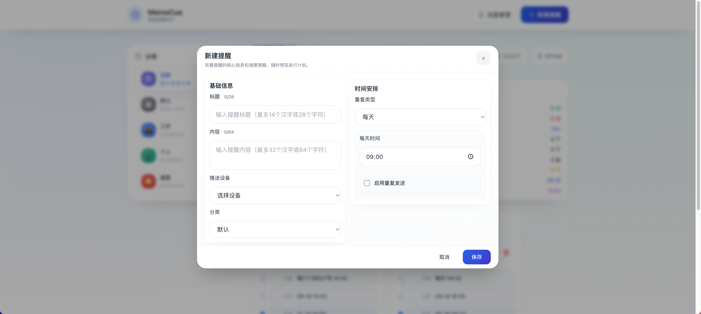

# 📱 MemoCue Lite

<div align="center">

**轻量级智能提醒助手**

一款简洁优雅的定时提醒服务，通过 Bark 推送无缝同步到 iOS 设备  
让您的重要事项永不遗漏 ⏰

[](https://nodejs.org/)
[](LICENSE)
[](https://apps.apple.com/app/bark-customed-notifications/id1403753865)

</div>

---

## 📸 界面预览

<div align="center">

### 🏠 主控制台
智能任务卡片，实时状态更新，支持拖拽排序


### 📱 设备管理
多设备支持，一键测试推送连通性


### ✏️ 任务编辑
丰富的定时选项，直观的配置界面



</div>

---

## ✨ 主要特性

### 🎯 灵活的提醒方式
- **多种定时模式**：一次性、每日、每周、每月、自定义间隔、Cron 表达式
- **智能重复发送**：支持失败重试，确保重要通知不丢失
- **执行状态跟踪**：自动记录成功/失败状态，提供详细的执行历史

### 📱 设备管理
- **多设备支持**：管理多台 iOS 设备，灵活切换推送目标
- **快速测试**：一键测试推送连通性，确保设备配置正确
- **安全加密**：设备密钥本地加密存储，保护隐私安全

### 🎨 现代化界面
- **直观的 Web 控制台**：基于 Alpine.js 的响应式单页应用
- **智能分类管理**：自定义分类，支持图标和颜色个性化
- **实时拖拽排序**：直观的卡片拖拽，随心调整任务优先级
- **实时状态更新**：SSE 推送，任务状态变化即时可见

### 💾 数据安全
- **本地存储**：数据完全存储在本地 JSON 文件，无需担心隐私泄露
- **备份恢复**：内置导入导出功能，支持一键备份和迁移
- **原子写入**：采用原子文件操作，确保数据完整性

## 🛠️ 技术栈

| 分类 | 技术选型 | 说明 |
|------|----------|------|
| **后端** | Node.js + Express | 轻量级 Web 服务器 |
| | node-cron | 定时任务调度 |
| | winston | 结构化日志记录 |
| **前端** | Alpine.js | 轻量级响应式框架 |
| | Tailwind CSS | 实用优先的 CSS 框架 |
| | Day.js | 轻量级日期处理库 |
| **工具链** | esbuild | 快速构建工具 |
| | proper-lockfile | 文件锁机制 |
| | write-file-atomic | 原子文件写入 |

## 🚀 快速开始

### 环境要求
- Node.js ≥ 18.0.0
- iOS 设备 + [Bark App](https://apps.apple.com/app/bark-customed-notifications/id1403753865)

### 安装步骤

```bash
# 1. 克隆项目
git clone https://github.com/your-username/memocue-lite.git
cd memocue-lite

# 2. 安装依赖
npm install

# 3. 初始化数据和配置
npm run data:init

# 4. 启动服务
npm start
```

### 首次配置

1. 📱 **安装 Bark**：在 App Store 下载 [Bark](https://apps.apple.com/app/bark-customed-notifications/id1403753865)
2. 🔑 **获取密钥**：打开 Bark，复制设备密钥（形如：`https://api.day.app/your-key`）
3. 🌐 **打开控制台**：浏览器访问 [http://localhost:3000](http://localhost:3000)
4. ⚙️ **添加设备**：点击"设备管理" → "添加设备"，粘贴 Bark 密钥
5. ✅ **测试连接**：点击"测试推送"确保配置正确
6. 📝 **创建提醒**：点击"创建提醒"开始使用

## 📋 常用命令

| 命令 | 说明 | 使用场景 |
|------|------|----------|
| `npm start` | 启动开发服务器 | 日常开发和使用 |
| `npm run build` | 构建生产版本 | 部署前优化资源 |
| `npm run data:init` | 初始化数据和配置 | 首次安装或重置 |
| `npm run data:backup` | 创建数据快照 | 定期备份数据 |
| `npm run check` | 代码质量检查 | 开发时代码规范检查 |

## 📁 项目结构

```
MemoCue/
├── 📂 src/                    # 后端核心代码
│   ├── 🔧 config/            # 配置常量
│   ├── 🛡️ middleware/         # 中间件（认证、验证、错误处理）
│   ├── 🚀 providers/         # 推送服务提供者
│   ├── 🛣️ routes/            # API 路由定义
│   ├── ⚙️ services/          # 业务逻辑服务
│   ├── 🔨 utils/             # 工具函数
│   └── 🌟 server.js          # 应用入口
├── 📂 public/                 # 前端资源
│   ├── 🎨 styles/            # 样式文件
│   ├── 📜 js/                # JavaScript 模块
│   ├── 🧩 components/        # HTML 组件
│   └── 🏠 index.html         # 主页面
├── 📂 data/                   # 数据存储
│   ├── 📋 tasks.json         # 任务数据
│   ├── 📱 devices.json       # 设备配置
│   ├── 📂 categories.json    # 分类设置
│   └── 📂 logs/              # 执行日志
├── 📂 scripts/                # 工具脚本
│   ├── 🔧 init-data.js       # 数据初始化
│   └── 💾 backup.js          # 备份工具
└── 📄 package.json           # 项目配置
```

## ⚙️ 配置说明

### 环境变量配置

项目支持通过环境变量进行配置，可创建 `.env` 文件：

```bash
# 服务端口（可选，默认3000）
PORT=3000

# CORS 来源控制（可选，默认允许所有）
CORS_ORIGIN=*

# 加密密钥（推荐设置）
ENCRYPTION_SECRET=your-secret-key-here
```

### API 接口

| 端点 | 方法 | 说明 |
|------|------|------|
| `/api/tasks` | GET/POST/PUT/DELETE | 任务管理 |
| `/api/devices` | GET/POST/DELETE | 设备管理 |
| `/api/categories` | GET/POST/PUT/DELETE | 分类管理 |
| `/api/push/:taskId` | POST | 测试推送 |
| `/api/logs` | GET | 获取执行日志 |
| `/events` | GET | SSE 实时事件流 |

## 🚀 部署指南

### 直接启动
```bash
# 启动服务（使用 nodemon，支持热重载）
npm start

# 构建前端资源（可选）
npm run build
```

### 使用 PM2 管理（推荐生产环境）
```bash
# 安装 PM2
npm install -g pm2

# 启动服务
pm2 start src/server.js --name memocue

# 查看状态
pm2 status

# 查看日志
pm2 logs memocue

# 重启服务
pm2 restart memocue
```

### 安全建议

- 🔐 **设置加密密钥**：创建 `.env` 文件并设置 `ENCRYPTION_SECRET`
- 🌐 **网络访问控制**：设置 `CORS_ORIGIN` 限制访问来源
- 🔄 **定期备份**：使用 `npm run data:backup` 定期备份数据
- 📊 **监控日志**：定期检查 `data/logs/` 下的日志文件

## 🔧 故障排除

### 常见问题

**Q: 推送失败怎么办？**
- 检查 Bark 密钥是否正确
- 确认网络连接正常
- 查看 `data/logs/error.log` 获取详细错误信息

**Q: 定时任务不执行？**
- 检查系统时间是否正确
- 确认任务状态为"启用"
- 查看控制台是否有错误提示

**Q: 数据丢失怎么恢复？**
- 使用 `npm run data:backup` 创建的备份文件
- 手动恢复 `data/` 目录下的 JSON 文件

## 🤝 贡献指南

欢迎提交 Issue 和 Pull Request！

1. Fork 本仓库
2. 创建特性分支：`git checkout -b feature/amazing-feature`
3. 提交更改：`git commit -m 'Add amazing feature'`
4. 推送分支：`git push origin feature/amazing-feature`
5. 提交 Pull Request

## 📄 许可证

本项目采用 MIT 许可证 - 查看 [LICENSE](LICENSE) 文件了解详情

---

<div align="center">

**⭐ 如果这个项目对你有帮助，请给个 Star 支持一下！**

Made with ❤️ by [Your Name]

</div>
